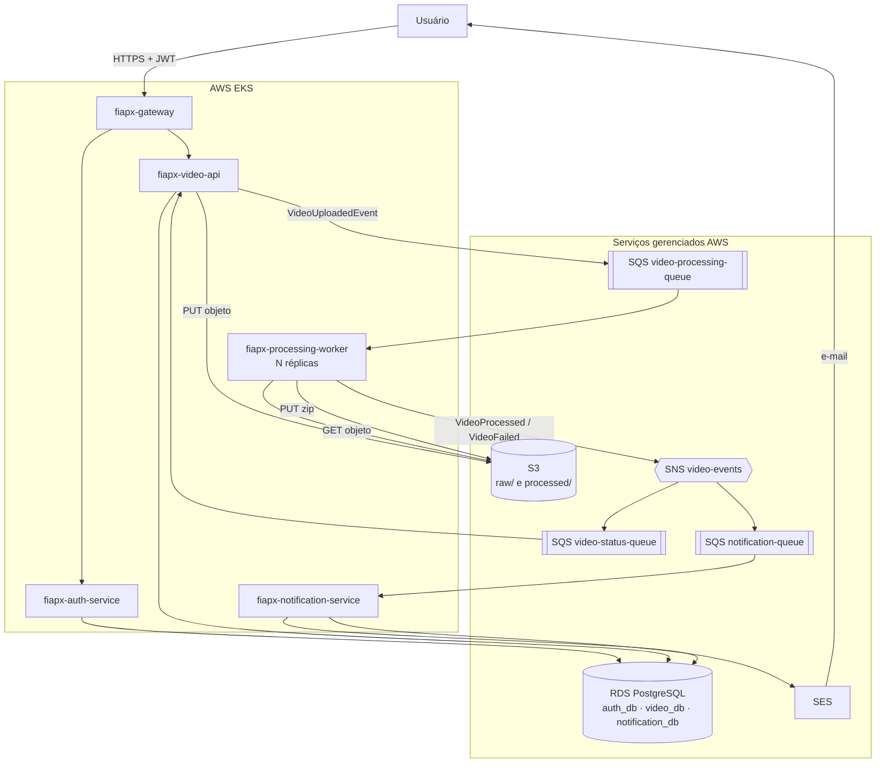

# FIAP X — Sistema de Processamento de Vídeos
## Documento de Arquitetura (Design Spec)

**Data:** 2026-09-10
**Contexto:** Hackathon POSTECH SOAT — Fase 5
**Status:** Aprovado para implementação — revisado em 2026-09-12 (prazo de 7 dias; seções 12, 14, 15, 17, 18 e 19)

---

## 1. Objetivo

Reescrever o protótipo de processamento de vídeos da FIAP X — hoje um monolito Go de
arquivo único — como um sistema de microsserviços que suporte múltiplos usuários
autenticados enviando vídeos concorrentemente, sem perda de requisições em pico, com
persistência, escalabilidade horizontal, testes automatizados e CI/CD.

### 1.1 Ponto de partida

O projeto base (`main.go`, 378 linhas) implementa:

- servidor Gin com HTML embutido em string;
- `POST /upload` que grava o arquivo em disco e executa `ffmpeg` **de forma síncrona
  dentro da requisição HTTP**;
- extração de frames a `fps=1` no padrão `frame_%04d.png`;
- compactação em ZIP flat (deflate) em `outputs/`;
- `GET /api/status` que lista arquivos via `filepath.Glob` no sistema de arquivos;
- `GET /download/:filename` servindo o arquivo do disco.

Não há banco de dados, autenticação, fila, testes, CI ou separação em camadas. O
`Dockerfile` declara no próprio comentário que não segue boas práticas (executa
`go run` sobre a imagem de build, sem multi-stage).

O comportamento funcional acima é a **especificação de referência**: o novo sistema deve
produzir o mesmo artefato final (ZIP de frames a 1 fps). O código Go não é migrado; é
preservado em `legacy/` para comparação "antes × depois" na apresentação.

---

## 2. Requisitos

### 2.1 Funcionais (do enunciado)

| ID | Requisito |
|---|---|
| RF-01 | Processar mais de um vídeo ao mesmo tempo |
| RF-02 | Em caso de picos, não perder nenhuma requisição |
| RF-03 | Sistema protegido por usuário e senha |
| RF-04 | Listagem de status dos vídeos de um usuário |
| RF-05 | Notificar o usuário em caso de erro |

### 2.2 Técnicos (do enunciado)

| ID | Requisito |
|---|---|
| RT-01 | Persistir os dados |
| RT-02 | Arquitetura que permita ser escalada |
| RT-03 | Projeto versionado no GitHub |
| RT-04 | Testes que garantam a qualidade |
| RT-05 | CI/CD da aplicação |

### 2.3 Fora de escopo (YAGNI)

Transcodificação ou mudança de resolução; geração de thumbnails; upload retomável
(resumable); edição de vídeo; cobrança/billing; multi-tenancy além do isolamento por
usuário; internacionalização; painel administrativo.

---

## 3. Decisões arquiteturais

Cada decisão abaixo vira um ADR curto em `fiapx-infra/docs/adr/`.

| # | Decisão | Alternativas descartadas | Motivo |
|---|---|---|---|
| ADR-01 | Java 21 + Spring Boot 3.3 (Gradle) | Manter Go; Node/NestJS | Ecossistema maduro para segurança, persistência e observabilidade; alinhado ao curso |
| ADR-02 | Cinco serviços, com API Gateway próprio | 2, 3 ou 4 serviços | Fronteiras de domínio explícitas; gateway centraliza roteamento e validação de token |
| ADR-03 | Multi-repo (um repositório por serviço) | Monorepo Gradle | Ciclo de vida e deploy independentes por serviço |
| ADR-04 | Clean Architecture / Hexagonal em todos os serviços | Camadas Controller/Service/Repository | Domínio testável sem framework; vocabulário do curso |
| ADR-05 | AWS gerenciada: EKS, S3, SQS/SNS, RDS, SES, ECR | Self-hosted no cluster; ECS Fargate; Azure | Menos superfície operacional; durabilidade de fila e storage sem operar broker |
| ADR-06 | Database per service, schemas separados na mesma instância RDS | Instância por serviço; banco único | Isolamento correto ao custo de uma instância (viável no free tier) |
| ADR-07 | Processamento assíncrono com `202 Accepted` | Processamento síncrono na requisição (como hoje) | Desacopla o pico de carga; atende RF-02 |
| ADR-08 | Download por presigned URL do S3 | Streaming pela API | Não ocupa thread nem banda da aplicação |
| ADR-09 | Escala do worker por KEDA (profundidade da fila SQS) | HPA por CPU | Métrica que reflete a carga real; CPU é indireta em I/O + ffmpeg |
| ADR-10 | Notificação por AWS SES com fallback para log | SMTP genérico; notificação in-app | E-mail real na demonstração; fallback mantém o ambiente local funcional |

---

## 4. Repositórios

| Repositório | Conteúdo |
|---|---|
| `fiapx-contracts` | Eventos e DTOs compartilhados; publicado no GitHub Packages, versionado por semver |
| `fiapx-gateway` | Spring Cloud Gateway: roteamento, validação de JWT, rate limit, serve a UI estática |
| `fiapx-auth-service` | Cadastro, login, BCrypt, emissão de JWT RS256, endpoint JWKS |
| `fiapx-video-api` | Upload, listagem de status, download; publica na fila e consome eventos de resultado |
| `fiapx-processing-worker` | Consome a fila, executa ffmpeg, compacta, publica o resultado |
| `fiapx-notification-service` | Consome eventos de falha e envia e-mail via SES; registra as tentativas |
| `fiapx-infra` | Terraform (AWS), manifests Helm/K8s, `docker-compose.yml`, scripts SQL, ADRs, diagramas |

**Regra de contrato:** mudanças em eventos são **aditivas**. Remover ou renomear campo
exige nova versão maior de `fiapx-contracts` e período de convivência das duas versões.

---

## 5. Arquitetura

### 5.1 Diagrama de containers (C4 nível 2)



### 5.2 Fluxo de submissão

1. Cliente autentica em `POST /api/v1/auth/login` e recebe um JWT RS256.
2. Cliente envia `POST /api/v1/videos` (multipart) com o token.
3. `video-api` valida extensão e tamanho, gera `videoId` (UUID v4), grava o arquivo em
   `s3://<bucket>/raw/{userId}/{videoId}{ext}`, insere o registro com `status=PENDING`,
   publica `VideoUploadedEvent` na `video-processing-queue` e responde
   **`202 Accepted`** com `{ videoId, status }`.
4. Um worker recebe a mensagem (long polling), publica `VideoProcessingStartedEvent`,
   baixa o objeto para um diretório temporário, executa
   `ffmpeg -i <in> -vf fps=1 -y frame_%04d.png`, compacta os PNGs em ZIP flat com
   deflate, envia para `s3://<bucket>/processed/{userId}/{videoId}.zip` e publica
   `VideoProcessedEvent` no tópico SNS.
5. `video-api` consome `video-status-queue` e atualiza o registro para
   `COMPLETED` (com `frameCount` e `s3ZipKey`) ou `FAILED` (com `errorCode` e mensagem).
6. `notification-service` consome `notification-queue` e, **apenas em falha**, envia
   e-mail via SES, registrando a tentativa em `notification_db`.
7. Cliente consulta `GET /api/v1/videos` e, quando `COMPLETED`, chama
   `GET /api/v1/videos/{id}/download`, que devolve uma presigned URL do S3.

### 5.3 Máquina de estados

```
PENDING ──> PROCESSING ──> COMPLETED
   │             │
   └─────────────┴────────> FAILED
```

Transições são gravadas em `video_status_history` para auditoria. Transições inválidas
(ex.: `COMPLETED → PROCESSING`) são ignoradas com log de aviso — isso garante
idempotência diante de entrega duplicada do SQS.

---

## 6. Contratos de evento (`fiapx-contracts`)

Envelope comum a todos os eventos:

```json
{
  "eventId": "uuid",
  "eventType": "VideoUploaded | VideoProcessingStarted | VideoProcessed | VideoFailed",
  "eventVersion": 1,
  "occurredAt": "2026-09-10T14:03:11Z",
  "correlationId": "uuid (= videoId)",
  "payload": { }
}
```

| Evento | Payload |
|---|---|
| `VideoUploaded` | `videoId`, `userId`, `userEmail`, `s3RawKey`, `originalFilename`, `sizeBytes` |
| `VideoProcessingStarted` | `videoId`, `userId`, `workerId`, `attempt` |
| `VideoProcessed` | `videoId`, `userId`, `s3ZipKey`, `frameCount`, `processingMillis` |
| `VideoFailed` | `videoId`, `userId`, `userEmail`, `errorCode`, `errorMessage`, `attempt` |

`errorCode` é enumerado: `INVALID_FORMAT`, `FFMPEG_FAILURE`, `NO_FRAMES_EXTRACTED`,
`STORAGE_FAILURE`, `TIMEOUT`, `UNKNOWN`.

---

## 7. Modelo de dados

Migrations por serviço com **Flyway**. O script consolidado exigido como entregável fica
em `fiapx-infra/sql/schema.sql`.

### 7.1 `auth_db`

```sql
CREATE TABLE users (
    id            UUID PRIMARY KEY,
    email         VARCHAR(255) NOT NULL UNIQUE,
    password_hash VARCHAR(60)  NOT NULL,     -- BCrypt cost 12
    full_name     VARCHAR(120) NOT NULL,
    enabled       BOOLEAN      NOT NULL DEFAULT TRUE,
    created_at    TIMESTAMPTZ  NOT NULL DEFAULT NOW(),
    updated_at    TIMESTAMPTZ  NOT NULL DEFAULT NOW()
);
CREATE UNIQUE INDEX idx_users_email_lower ON users (LOWER(email));
```

### 7.2 `video_db`

```sql
CREATE TABLE videos (
    id                UUID PRIMARY KEY,
    user_id           UUID         NOT NULL,   -- sem FK: pertence a outro serviço
    user_email        VARCHAR(255) NOT NULL,
    original_filename VARCHAR(255) NOT NULL,
    size_bytes        BIGINT       NOT NULL,
    s3_raw_key        VARCHAR(512) NOT NULL,
    s3_zip_key        VARCHAR(512),
    status            VARCHAR(20)  NOT NULL,   -- PENDING|PROCESSING|COMPLETED|FAILED
    frame_count       INTEGER,
    error_code        VARCHAR(40),
    error_message     TEXT,
    attempts          INTEGER      NOT NULL DEFAULT 0,
    created_at        TIMESTAMPTZ  NOT NULL DEFAULT NOW(),
    started_at        TIMESTAMPTZ,
    finished_at       TIMESTAMPTZ,
    updated_at        TIMESTAMPTZ  NOT NULL DEFAULT NOW()
);
CREATE INDEX idx_videos_user_created ON videos (user_id, created_at DESC);
CREATE INDEX idx_videos_status       ON videos (status);

CREATE TABLE video_status_history (
    id          BIGSERIAL PRIMARY KEY,
    video_id    UUID        NOT NULL REFERENCES videos (id) ON DELETE CASCADE,
    from_status VARCHAR(20),
    to_status   VARCHAR(20) NOT NULL,
    reason      TEXT,
    changed_at  TIMESTAMPTZ NOT NULL DEFAULT NOW()
);
```

### 7.3 `notification_db`

```sql
CREATE TABLE notifications (
    id                  UUID PRIMARY KEY,
    user_id             UUID         NOT NULL,
    video_id            UUID         NOT NULL,
    channel             VARCHAR(20)  NOT NULL,   -- EMAIL
    recipient           VARCHAR(255) NOT NULL,
    subject             VARCHAR(255) NOT NULL,
    body                TEXT         NOT NULL,
    status              VARCHAR(20)  NOT NULL,   -- PENDING|SENT|FAILED
    attempts            INTEGER      NOT NULL DEFAULT 0,
    provider_message_id VARCHAR(255),
    created_at          TIMESTAMPTZ  NOT NULL DEFAULT NOW(),
    sent_at             TIMESTAMPTZ
);
CREATE INDEX idx_notifications_video ON notifications (video_id);
```

---

## 8. APIs

Todas as rotas passam pelo gateway. Erros seguem **RFC 7807** (`application/problem+json`).

### 8.1 `auth-service`

| Método | Rota | Descrição |
|---|---|---|
| POST | `/api/v1/auth/register` | `{ email, password, fullName }` → `201` |
| POST | `/api/v1/auth/login` | `{ email, password }` → `200 { accessToken, tokenType, expiresIn }` |
| GET | `/api/v1/auth/me` | Dados do usuário do token |
| GET | `/.well-known/jwks.json` | Chave pública para validação do JWT |

### 8.2 `video-api`

| Método | Rota | Descrição |
|---|---|---|
| POST | `/api/v1/videos` | multipart `video` → `202 { videoId, status }` |
| GET | `/api/v1/videos` | `?status=&page=&size=` → página de resumos do usuário do token |
| GET | `/api/v1/videos/{id}` | Detalhe, incluindo `errorMessage` quando `FAILED` |
| GET | `/api/v1/videos/{id}/download` | `200 { url, expiresAt }` com presigned URL (expira em 15 min) |

Validações no upload: extensão em `.mp4 .avi .mov .mkv .wmv .flv .webm`; tamanho máximo
**200 MB** (configurável); `Content-Type` coerente. Acesso a vídeo de outro usuário
retorna `404` (não `403`), para não vazar existência.

---

## 9. Segurança

- Senhas com **BCrypt** cost 12; nunca logadas nem retornadas.
- **JWT RS256**, expiração de 1 hora. A chave privada vive apenas no `auth-service`
  (AWS Secrets Manager); os demais serviços validam pela JWKS pública.
- O gateway valida o token **e** cada serviço revalida (defesa em profundidade). Não se
  confia em header injetado pelo gateway.
- Acesso a S3, SQS, SNS e SES via **IRSA** (IAM Roles for Service Accounts) — nenhuma
  chave estática em imagem ou manifest.
- Buckets S3 privados, criptografia SSE-S3, bloqueio total de acesso público. Todo acesso
  do cliente é por presigned URL.
- Rate limit no gateway em `/auth/login` para conter força bruta.
- Segredos em K8s Secrets alimentados pelo Secrets Manager; nada versionado no Git.
- Trivy escaneia as imagens no CI; o build falha em vulnerabilidade `HIGH`/`CRITICAL`.

---

## 10. Resiliência e escala

| Preocupação | Mecanismo |
|---|---|
| Perda de requisição em pico (RF-02) | `202 Accepted` + SQS durável; a API nunca bloqueia esperando o ffmpeg |
| Falha do worker no meio do trabalho | Visibility timeout de 15 min; a mensagem retorna à fila automaticamente |
| Poison message | `maxReceiveCount = 3` → **DLQ**; alarme no CloudWatch sobre a DLQ |
| Entrega duplicada (SQS é at-least-once) | Idempotência por `videoId` + máquina de estados que ignora transição inválida |
| Vídeo grande travando o worker | Timeout de 10 min no `ProcessBuilder`; ao estourar, `errorCode=TIMEOUT` |
| Escala do processamento (RT-02) | **KEDA** `aws-sqs-queue`: `queueLength=5`, `minReplicas=1`, `maxReplicas=10` |
| Escala da API | HPA por CPU (70%), 2 a 6 réplicas |
| Encerramento gracioso | `terminationGracePeriodSeconds=900`; o worker termina a mensagem em curso antes de sair |
| Disco efêmero do worker | `emptyDir` com limite; diretório temporário sempre removido em `finally` |

---

## 11. Observabilidade

- **Spring Boot Actuator** em todos os serviços: `/actuator/health/liveness`,
  `/health/readiness`, `/actuator/prometheus` (Micrometer).
- **Prometheus** no cluster com `ServiceMonitor` por serviço; **Grafana** com um dashboard
  contendo: profundidade da fila, mensagens na DLQ, duração do processamento (p50/p95),
  taxa de erro por `errorCode`, réplicas do worker, latência HTTP da API.
- Métricas de negócio customizadas: `fiapx_videos_submitted_total`,
  `fiapx_videos_processed_total`, `fiapx_video_processing_seconds`,
  `fiapx_videos_failed_total{errorCode}`.
- **Logs JSON estruturados** com `correlationId = videoId` propagado do upload até a
  notificação, permitindo rastrear um vídeo por todos os serviços.

---

## 12. Estratégia de testes

| Camada | Ferramenta | Escopo |
|---|---|---|
| Domínio | JUnit 5 | Entidades, máquina de estados, validações. Sem Spring, sem I/O |
| Aplicação | JUnit 5 + Mockito | Use cases com ports mockados |
| Infraestrutura | Testcontainers (PostgreSQL) | Repositórios JPA e migrations Flyway |
| Mensageria e storage | Testcontainers + **LocalStack** | Publicação/consumo SQS e SNS, upload/download S3, presigned URL |
| Web | `@WebMvcTest` + Spring Security Test | Contratos REST, autorização, formato de erro |
| ffmpeg | Fixture de vídeo de 2 s no repositório | Contagem de frames e conteúdo do ZIP |
| E2E | Compose + REST Assured | login → upload → polling até `COMPLETED` → download |
| Carga (RF-02) | **k6** (`fiapx-infra/load/burst.js`) | 100 submissões em rajada com 10 usuários virtuais; em seguida, polling até nenhuma ficar em `PENDING`/`PROCESSING`. Passa se `COMPLETED + FAILED = 100` e nenhum upload receber `5xx`. O relatório entra no vídeo e no README |

**Gate:** JaCoCo com mínimo de **80% de cobertura de linha** sobre `domain` e
`application`; o build falha abaixo disso. Pacotes de configuração e DTOs são excluídos
da contagem.

---

## 13. CI/CD (GitHub Actions)

Cada repositório de serviço tem dois workflows.

**`ci.yml`** (em pull request e push):
`checkout` → `setup-java 21` → cache Gradle → `./gradlew build` (compila + testes
unitários e de integração) → verificação JaCoCo → build da imagem → **Trivy** →
publica relatórios como artifacts.

**`cd.yml`** (em push na `main`, após CI verde):
assume role AWS via **OIDC** (sem chave estática) → login no ECR → build e push da imagem
com tag `sha-<commit>` e `latest` → `aws eks update-kubeconfig` →
`helm upgrade --install <serviço> ./chart --set image.tag=sha-<commit>` →
aguarda rollout e faz rollback automático em falha.

`fiapx-contracts` publica no GitHub Packages a cada tag `v*`.
`fiapx-infra` roda `terraform plan` em PR e `terraform apply` por `workflow_dispatch`
manual, nunca automático.

---

## 14. Infraestrutura AWS (Terraform)

Módulos em `fiapx-infra/terraform/`:

| Módulo | Recursos |
|---|---|
| `network` | VPC, subnets públicas e privadas, NAT gateway, security groups |
| `eks` | Cluster EKS, node group gerenciado, OIDC provider |
| `rds` | Instância PostgreSQL, três bancos, subnet group, secret no Secrets Manager |
| `storage` | Bucket S3 com prefixos `raw/` e `processed/`, lifecycle apagando `raw/` após 7 dias |
| `messaging` | `video-processing-queue` + DLQ, tópico SNS `video-events`, `video-status-queue`, `notification-queue` + DLQs |
| `email` | Identidade SES verificada |
| `ecr` | Um repositório por serviço, com scan on push |
| `iam` | Roles IRSA por serviço, com política de menor privilégio |

O `README` do repositório documenta `terraform destroy` de forma destacada, para evitar
custo residual após a apresentação.

**Dimensionamento para o hackathon (custo e tempo):**

- EKS não tem free tier: o control plane custa cerca de US$ 0,10/h. O cluster só é criado
  no D5 e destruído no D7, cerca de 72 horas no total.
- Um único NAT gateway, em uma AZ, em vez de um por AZ. As subnets privadas continuam.
- Node group gerenciado com 2 × `t3.medium` on-demand. Spot foi descartado para não haver
  interrupção durante a gravação.
- RDS `db.t3.micro` single-AZ, sem réplica.
- Estimativa total da janela: da ordem de US$ 20–30. Um alarme do AWS Budgets em US$ 30 é
  criado no D1.
- Estado do Terraform em backend S3 com lock no DynamoDB, criado por um script de
  bootstrap (`terraform/bootstrap/`). Assim o `apply` via GitHub Actions e o local
  compartilham o mesmo estado.

---

## 15. Ambiente local (plano B da gravação)

`fiapx-infra/docker-compose.yml` sobe a stack inteira sem AWS:

- `postgres` com os três bancos criados por script de init;
- `localstack` provendo S3, SQS, SNS e SES (a inicialização cria filas, tópico e bucket);
- os cinco serviços, cada um com perfil `local`;
- `mailpit` (SMTP na porta 1025, caixa de entrada web em `http://localhost:8025`);
- `prometheus` e `grafana` com o dashboard provisionado.

O `notification-service` tem um port `EmailSender` com dois adapters: **SES** (perfil
`aws`) e **SMTP** (perfil `local`, apontando para o Mailpit). Assim a demonstração local
mostra um e-mail de falha de verdade na caixa de entrada do Mailpit, e não só uma linha
de log.

**URL assinada no ambiente local:** dentro da rede do Compose os serviços acessam o
LocalStack por `http://localstack:4566`, um host que o navegador do usuário não resolve.
O `video-api` usa a propriedade `fiapx.s3.public-endpoint` (`S3_PUBLIC_ENDPOINT=http://localhost:4566`)
apenas para gerar a presigned URL. Na AWS ela fica vazia e o presigner usa o endpoint
padrão do S3. A
suíte E2E roda contra esse ambiente, o que o mantém sempre funcional — e garante uma
demonstração gravável mesmo se o cluster EKS estiver indisponível.

---

## 16. Entregáveis

| Entregável | Onde |
|---|---|
| Documentação da arquitetura | `fiapx-infra/docs/arquitetura.md` com diagramas C4 (contexto, container, componente) em Mermaid |
| ADRs | `fiapx-infra/docs/adr/ADR-001..010.md` |
| Script de criação do banco | `fiapx-infra/sql/schema.sql` (além das migrations Flyway) |
| Scripts dos demais recursos | `fiapx-infra/terraform/` |
| Código | Sete repositórios no GitHub, com README próprio |
| Documentação de API | OpenAPI/Swagger UI em cada serviço |
| Roteiro do vídeo | `fiapx-infra/docs/roteiro-apresentacao.md`, 10 minutos |

---

## 17. Sequência de execução

> **Revisão 2026-09-12:** o prazo real é de **7 dias** (12/09 a 18/09/2026), com uma
> pessoa implementando. As três "semanas" originais foram comprimidas em sete dias, com
> checkpoints de ir/não ir. As decisões de arquitetura (AWS EKS + Terraform, sete
> repositórios) foram mantidas.

| Dia | Data | Entrega | Checkpoint ao final do dia |
|---|---|---|---|
| D1 | 12/09 | Plano 1, tarefas 1–7: workspace, `fiapx-contracts`, `auth-service` completo. Repositórios criados no GitHub. **Paralelo (usuário):** conta AWS com alarme de orçamento, instalar `aws` CLI e `terraform`, verificar o e-mail no SES | `auth-service` com `./gradlew build` verde |
| D2 | 13/09 | Plano 1, tarefas 8–15: `video-api` completo | Upload `202` e listagem via testes de integração |
| D3 | 14/09 | Plano 1, tarefas 16–22: `processing-worker`, Compose e E2E. Escrever o Plano 2 | **Demonstração local gravável** (critérios da Fase 1). Gravar um take de segurança |
| D4 | 15/09 | Plano 2, parte 1: `notification-service` (SES e Mailpit local), gateway com UI estática, workflow de CI reutilizável aplicado aos sete repositórios | RF-05 comprovado no Compose; CI verde em todos os repositórios |
| D5 | 16/09 | Plano 2, parte 2: Terraform (network, eks, rds, storage, messaging, ecr, iam, email) e chart Helm genérico | **Ir/não ir do EKS:** se às 20h o cluster não estiver servindo os serviços, a gravação usa o Compose e o EKS vira seção de "próximos passos" |
| D6 | 17/09 | Plano 3: CD por OIDC até o EKS, kube-prometheus-stack com o dashboard, KEDA, teste de carga k6 (RF-02) | Critérios 1–7 da seção 20 verificados no EKS |
| D7 | 18/09 | Documentação (arquitetura C4, ADRs, READMEs), roteiro, gravação e `terraform destroy` | Vídeo ≤ 10 min publicado; links entregues |

**Regras de prazo:**

- O RF-05 (notificação) é requisito essencial do enunciado: é a **primeira** tarefa do
  Plano 2 e não entra na lista de corte antes do item 6.
- Atraso de meio dia em qualquer checkpoint aciona o próximo item da lista de corte
  (seção 19), sem negociação.
- O cluster EKS só é criado no D5 e é destruído no D7, logo após a gravação.

---

## 18. Riscos

| Risco | Impacto | Mitigação |
|---|---|---|
| Custo e tempo de operação do EKS | Alto | Compose completo mantido como plano B de gravação; `terraform destroy` documentado; node group pequeno |
| SES em sandbox só envia para endereços verificados | Médio | Verificar o e-mail do grupo no primeiro dia da semana 2 |
| Sete repositórios mantidos por 1–2 pessoas | Médio | `fiapx-contracts` versionado; mudanças de evento sempre aditivas; workflows de CI idênticos entre repos |
| Imagem do worker com ffmpeg (~300 MB) | Baixo | Multi-stage sobre `eclipse-temurin:21-jre-alpine` + `apk add ffmpeg` |
| Vídeos grandes estourando memória ou disco do pod | Médio | Limite de 200 MB no upload; streaming para disco (nunca para memória); `emptyDir` com limite; timeout de 10 min |
| Prazo de 7 dias com uma pessoa e sete repositórios | **Alto** | Cronograma D1–D7 com checkpoints (seção 17); lista de corte acionada por atraso de meio dia (seção 19); workflow de CI reutilizável e chart Helm genérico para não multiplicar trabalho por sete |
| Ferramentas AWS ausentes na máquina (`aws` CLI, `terraform`) e conta sem SES verificado | Médio | Instalação, alarme de orçamento e verificação do e-mail no SES feitos no D1, em paralelo à codificação |
| Download do ZIP quebrado no ambiente local (host da URL assinada) | Médio | `fiapx.s3.public-endpoint` (seção 15) e o teste E2E baixando o arquivo pela URL devolvida |

## 19. Lista de corte (nesta ordem, se o prazo apertar)

Revisada em 2026-09-12 para o prazo de 7 dias. Cada item é acionado por um atraso de meio
dia num checkpoint da seção 17.

1. **Redis** (cache de listagem e rate limit) — opcional desde o início.
2. **UI estática** — cai para demonstração via Swagger UI.
3. **`fiapx-gateway`** — cai para um Ingress (AWS Load Balancer Controller) roteando por
   caminho direto aos serviços. A segurança não muda, porque cada serviço já valida o JWT.
   Perde-se o rate limit do login, e isso é registrado no ADR-02.
4. **KEDA** — cai para HPA por CPU.
5. **Prometheus/Grafana no cluster** — cai para CloudWatch Container Insights. O Compose
   mantém Prometheus e Grafana para a demonstração do dashboard.
6. **EKS na gravação** — decisão do checkpoint do D5. A demonstração é gravada no Compose.
   O Terraform continua entregue como "script dos demais recursos", com `terraform plan`
   verde no CI, e o CD para no push da imagem no ECR.
7. **`notification-service` como serviço próprio** — cai para chamada direta ao SES pelo
   worker. *Este corte muda a decomposição; só usar em último caso.* O RF-05 nunca é cortado.

---

## 20. Critérios de aceitação

O projeto está pronto quando:

1. Dois vídeos enviados simultaneamente por usuários diferentes são processados em
   paralelo e ambos chegam a `COMPLETED`.
2. Cem submissões em rajada não perdem nenhuma requisição — a contagem de `COMPLETED`
   mais `FAILED` é igual à de submissões.
3. Requisição sem token ou com token inválido recebe `401`; usuário não vê vídeo de outro.
4. `GET /api/v1/videos` lista somente os vídeos do usuário autenticado, com o status
   correto.
5. Um vídeo corrompido resulta em `FAILED` com mensagem útil **e** e-mail recebido.
6. `./gradlew build` passa em todos os repositórios, com JaCoCo acima de 80%.
7. O pipeline de CD publica no EKS a partir de um push na `main`.
8. `docker compose up` sobe o sistema completo sem nenhuma credencial AWS.
